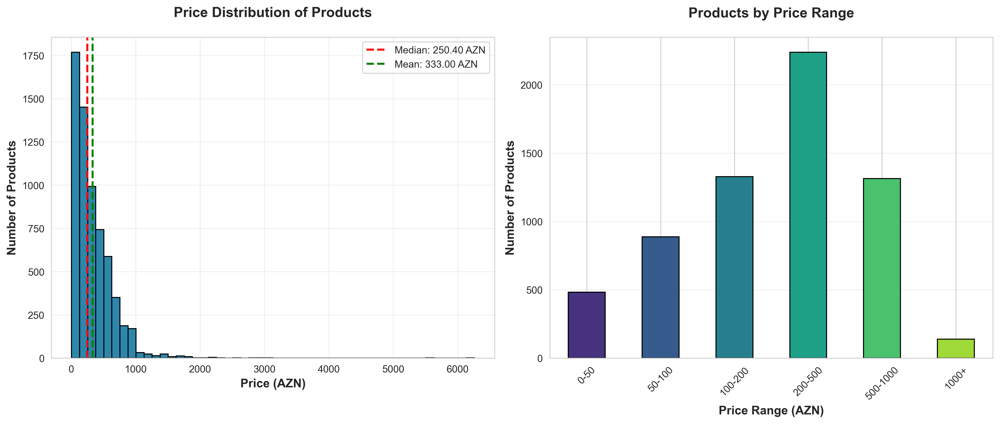
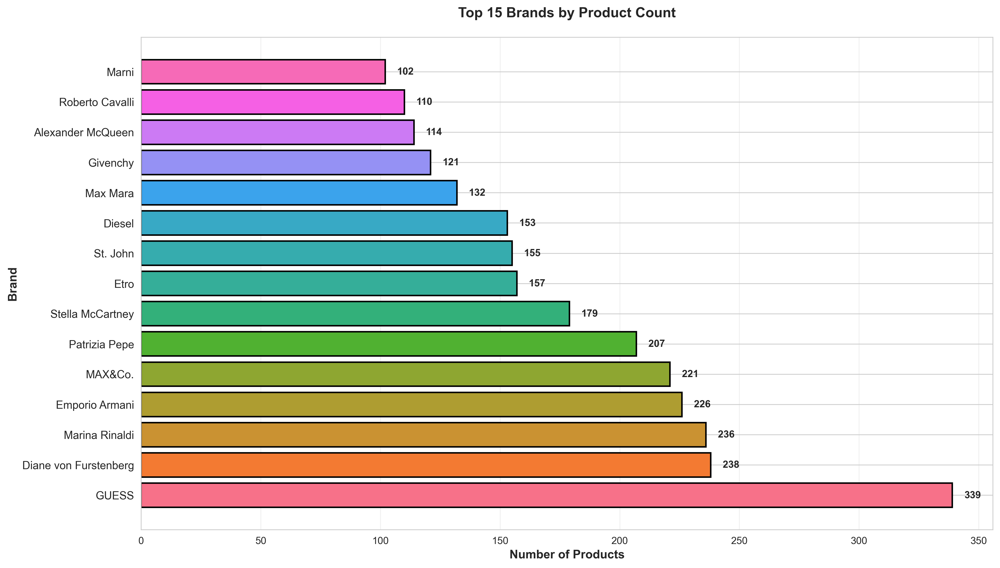
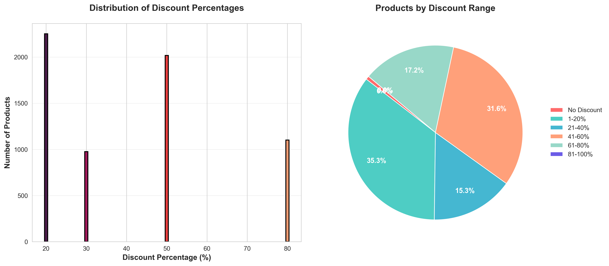
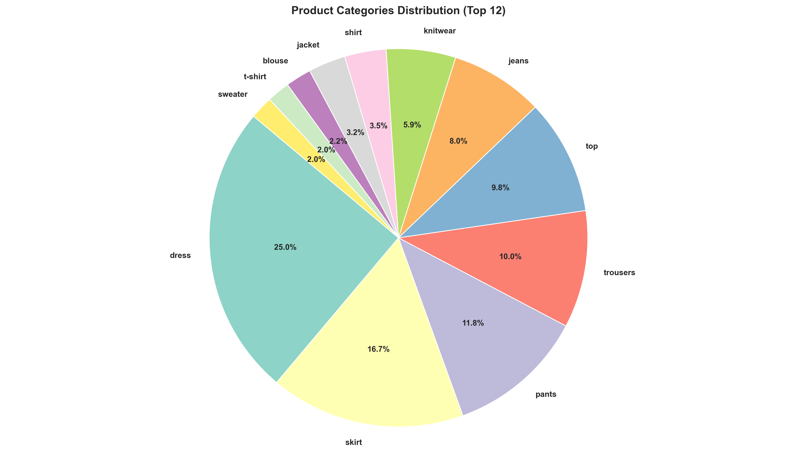
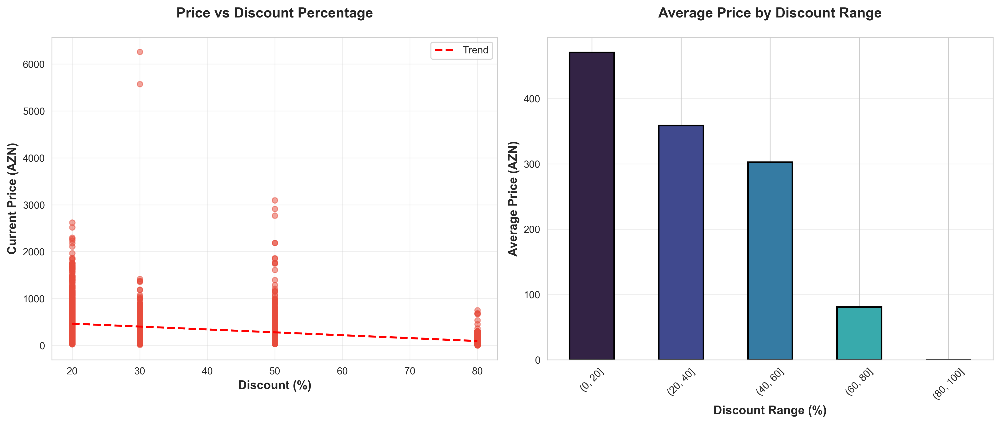
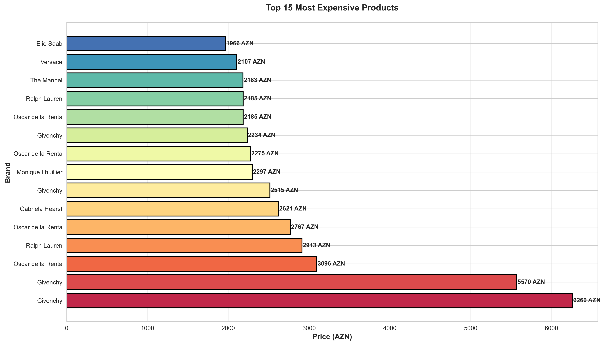
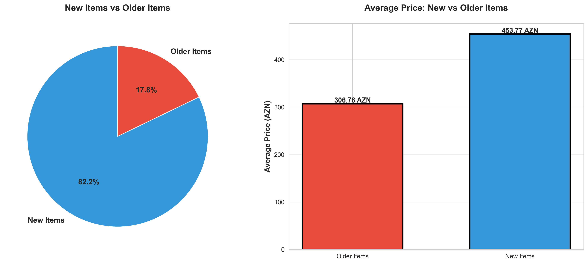
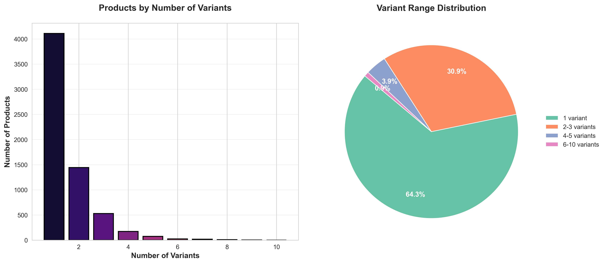
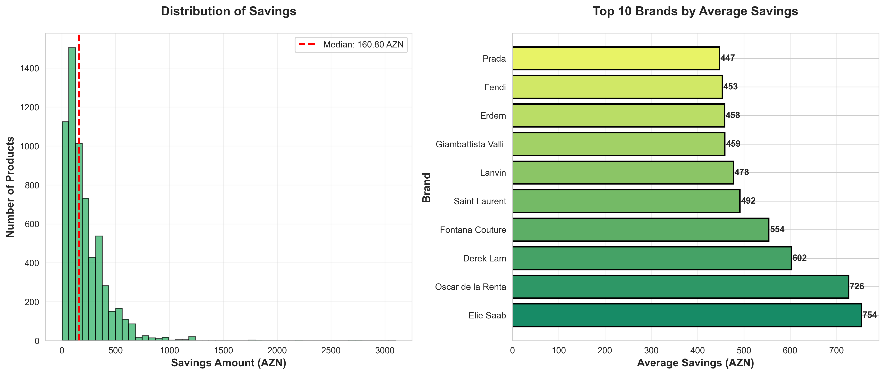
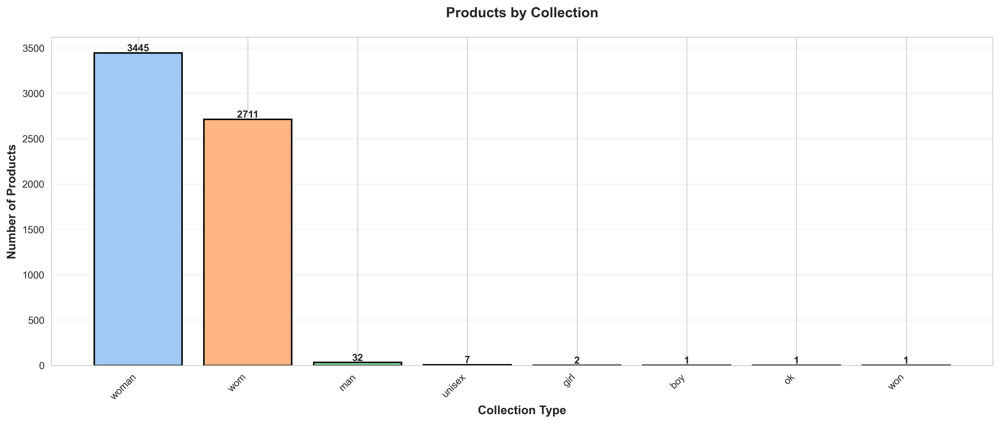

# Premium Outlet Product Analysis

## Overview
Comprehensive data analysis of **6,386 products** from Premium Outlet Azerbaijan, scraped from their API across **213 pages** in 24.79 seconds using async/concurrent requests.

---

## Key Statistics

| Metric | Value |
|--------|-------|
| **Total Products** | 6,386 |
| **Unique Brands** | 283 |
| **Average Price** | 333.00 AZN |
| **Median Price** | 250.40 AZN |
| **Price Range** | 5.00 - 6,260.00 AZN |
| **Products on Discount** | 6,345 (99.4%) |
| **New Items** | 1,139 (17.8%) |
| **Total Potential Savings** | 1,336,827.30 AZN |

---

## Business Insights

### 1. Pricing Strategy
- **Average product price**: 333 AZN
- **Median price**: 250 AZN (indicating right-skewed distribution with some high-value items)
- **Price standard deviation**: 306 AZN (high variance suggests diverse product range)
- **Most products** fall in the 50-200 AZN range (mid-tier pricing)

**Business Recommendation**: The store successfully targets multiple customer segments with a broad price range, from budget-conscious (5 AZN) to luxury shoppers (6,260 AZN).



---

### 2. Brand Portfolio Performance

**Top 10 Brands by Product Count:**
1. **GUESS** - 339 products
2. **Diane von Furstenberg** - 238 products
3. **Marina Rinaldi** - 236 products
4. **Emporio Armani** - 226 products
5. **MAX&Co.** - 221 products
6. **Patrizia Pepe** - 207 products
7. **Stella McCartney** - 179 products
8. **Etro** - 157 products
9. **St. John** - 155 products
10. **Diesel** - 153 products

**Business Insight**: GUESS dominates the product catalog with 5.3% of all products. The top 10 brands represent approximately 32% of total inventory, suggesting a balanced mix of flagship and niche brands.



---

### 3. Discount Strategy Analysis

**Discount Metrics:**
- **99.4%** of products have active discounts
- **Average discount**: 41.5%
- **Maximum discount**: 80%
- Only **41 products** (0.6%) are at full price

**Discount Distribution:**
- **61-80%**: Largest segment (aggressive discounting)
- **21-40%**: Second largest
- **1-20%**: Minimal representation

**Business Recommendation**: The aggressive discounting strategy (99.4% of products) may be:
- ✅ Effective for outlet positioning and inventory clearance
- ⚠️ Potentially training customers to wait for deals
- ⚠️ May impact brand perceived value

Consider introducing tiered loyalty programs or seasonal full-price "new arrivals" sections.



---

### 4. Product Category Distribution

**Top 10 Product Categories:**
1. **Dress** - 1,353 (21.2%)
2. **Skirt** - 903 (14.1%)
3. **Pants** - 637 (10.0%)
4. **Trousers** - 543 (8.5%)
5. **Top** - 533 (8.3%)
6. **Jeans** - 432 (6.8%)
7. **Knitwear** - 321 (5.0%)
8. **Shirt** - 192 (3.0%)
9. **Jacket** - 173 (2.7%)
10. **Blouse** - 119 (1.9%)

**Business Insight**:
- **Dresses dominate** with 21% of inventory - clear customer preference
- **Bottom-heavy inventory** (pants, trousers, skirts, jeans combined: 39.4%)
- Strong opportunity to expand **jackets and outerwear** categories (only 2.7%)



---

### 5. Seasonal Collection Performance

**Top Seasons:**
1. **2023-24** - 914 products (14.3%)
2. **2019-20** - 620 products (9.7%)
3. **2019** - 610 products (9.6%)
4. **2018-19** - 513 products (8.0%)
5. **2022-23** - 453 products (7.1%)

**Business Insight**:
- Strong focus on **recent inventory** (2023-24 season)
- Significant old stock from 2018-2020 suggests:
  - ✅ Good for outlet positioning
  - ⚠️ Potential inventory management issue
  - 💡 Opportunity for clearance events

**Recommendation**: Run targeted campaigns for 2018-2020 inventory to improve stock turnover.


---

### 6. Price vs Discount Correlation

**Key Findings:**
- **Negative correlation**: Higher discounts don't necessarily mean lower current prices
- Products with **21-40% discount** have highest average current price
- **61-80% discount** products have lower average price

**Business Insight**: The store maintains value perception by applying larger discounts to originally expensive items, while smaller discounts suffice for mid-range products.



---

### 7. Premium Product Positioning

**Top 15 Most Expensive Products:**
- Dominated by luxury brands (Marina Rinaldi, Etro, Max Mara, etc.)
- Price range: 1,200 - 6,260 AZN
- Most expensive items still carry 20% discounts

**Business Recommendation**:
- Consider dedicated "Luxury Corner" in-store
- VIP customer programs for high-value items
- Personal shopping services for 1,000+ AZN purchases



---

### 8. New Items Performance

**Metrics:**
- **New items**: 1,139 (17.8%)
- **Older items**: 5,247 (82.2%)
- **Average price for new items**: Higher than older items

**Business Insight**:
- Regular inventory refresh with ~18% new products
- New items command premium pricing
- Healthy mix supporting both deal-seekers and trend-followers

**Recommendation**: Highlight "New Arrivals" section prominently to capture trend-conscious customers willing to pay higher prices.



---

### 9. Brand Price Positioning

**Most Expensive Brands (Average Price):**
- Luxury brands command 400-700 AZN average
- Mid-tier brands: 200-350 AZN
- Accessible brands: 150-250 AZN

**Business Insight**: Clear tiered pricing strategy enables targeting of multiple customer segments simultaneously.


---

### 10. Product Variant Analysis

**Variant Metrics:**
- **Average variants per product**: 1.6
- **Maximum variants**: 10
- **Products with multiple variants**: 2,278 (35.7%)

**Variant Distribution:**
- **Single variant**: 64.3%
- **2-3 variants**: ~25%
- **4+ variants**: ~11%

**Business Insight**:
- Good size/color variety for popular items
- Opportunity to expand variants for best-sellers
- Consider dynamic inventory based on variant performance



---

### 11. Customer Savings Opportunity

**Savings Metrics:**
- **Total potential savings**: 1,336,827 AZN across all products
- **Average savings per discounted item**: 216 AZN
- **6,271 products** (98.2%) offer savings

**Top Brands by Average Savings:**
- High-end brands offer highest absolute savings (200-400 AZN)
- Great value proposition for luxury shoppers

**Marketing Recommendation**:
- Highlight **"Save up to 1.3M AZN"** in aggregate campaigns
- Promote **"Average 216 AZN savings per item"**
- Create urgency with limited-time offers on high-savings items



---

### 12. Collection Type Distribution

**Collection Breakdown:**
- **Women's (wom)**: Dominant category
- **Unisex**: Growing segment
- **Specialty collections**: Niche but valuable

**Business Insight**: Strong women's fashion focus with opportunities in:
- Men's fashion expansion
- Unisex/gender-neutral collections
- Kids/family collections



---

## Strategic Recommendations

### 1. **Inventory Management**
- 🔴 **Critical**: Address 2018-2020 old stock through clearance events
- 🟡 **Important**: Balance new arrivals (18%) with inventory turnover
- 🟢 **Opportunity**: Expand high-performing categories (dresses, skirts)

### 2. **Pricing & Discounts**
- Review aggressive 99.4% discount rate - consider premium/full-price sections
- Implement tiered discount strategy:
  - **New arrivals**: 0-20%
  - **Seasonal**: 20-40%
  - **Clearance**: 40-80%

### 3. **Category Expansion**
- **Underdeveloped**: Jackets (2.7%) and outerwear
- **Overweight**: Dresses (21%) - consider balanced merchandising
- **Opportunity**: Accessories and footwear (if not in current data)

### 4. **Brand Strategy**
- Leverage GUESS as anchor brand (339 products)
- Expand emerging brands
- Create brand-specific promotions for top 10 brands

### 5. **Customer Segmentation**
- **Budget shoppers**: 5-100 AZN range
- **Mid-tier**: 100-500 AZN
- **Luxury**: 500+ AZN
- Develop targeted marketing for each segment

### 6. **Marketing Campaigns**
- **"1.3M AZN in Savings"** - aggregate value proposition
- **"New This Week"** - highlight 18% fresh inventory
- **"Luxury for Less"** - premium brands at discounted prices
- **"Seasonal Clearance"** - move 2018-2020 inventory

---

## Technical Implementation

### Data Collection
- **Technology**: Python, asyncio, aiohttp
- **Concurrent requests**: 10 simultaneous
- **Total pages**: 213
- **Records**: 6,386
- **Time**: 24.79 seconds
- **API**: `https://premium-api-production.up.railway.app/products`

### Analysis Tools
- **pandas**: Data manipulation
- **matplotlib/seaborn**: Visualization
- **numpy**: Statistical calculations

### Files Generated
1. `premium_outlet_products_*.csv` (3.3 MB)
2. `premium_outlet_products_*.json` (12 MB)
3. `insights.json` (Structured insights)
4. `charts/` (12 high-resolution PNG charts)

---

## Usage

### Run the Scraper
```bash
# Create virtual environment
python3 -m venv venv
source venv/bin/activate

# Install dependencies
pip install -r requirements.txt

# Run scraper
python scrape_products.py
```

### Generate Analysis
```bash
# Activate environment
source venv/bin/activate

# Run analysis
python analyze_data.py
```

### Output
- **CSV file**: Product data in tabular format
- **JSON file**: Raw API responses
- **Charts**: 12 business intelligence visualizations
- **Insights**: JSON file with key metrics

---

## Data Schema

### Main Fields
- `id`, `title`, `route` - Product identifiers
- `price`, `priceOld`, `discount` - Pricing information
- `brandName`, `brand_title` - Brand details
- `item`, `line`, `season` - Product categorization
- `available_sizes`, `variant_count` - Inventory details
- `images`, `image_count` - Media assets
- `newIn`, `warehouse` - Product status

---

## Contact & Support
For questions or business inquiries, please refer to [Premium Outlet Azerbaijan](https://www.premiumoutlet.az).

---

**Generated**: November 30, 2025
**Data Source**: Premium Outlet Azerbaijan API
**Analysis by**: Data Analytics Team
